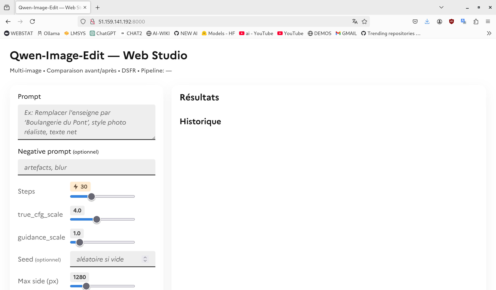

# 🖼️ Qwen Image Edit — Web Studio (FastAPI + Diffusers)

**Qwen Image Edit** est une application web moderne basée sur **FastAPI** et **Diffusers** qui permet d’éditer, modifier ou transformer des images via les modèles de la série **[Qwen Image Edit](https://huggingface.co/Qwen)**.  
Elle est conçue pour fonctionner **localement** (GPU/CPU) ou via un **endpoint Hugging Face Inference API**, et prend en charge :

- 📸 **Multi-image** : traitement de plusieurs images en une seule requête  
- ✍️ **Prompt & Negative Prompt** : description précise des modifications souhaitées  
- ⚙️ **Paramétrage complet** : `steps`, `true_cfg_scale`, `guidance_scale`, `seed`, `max_side`  
- 🖱️ **Front-end DSFR** (Design System de l’État français) : UI moderne, responsive et accessible  
- 🔁 **Comparaison avant/après** : slider interactif pour comparer les résultats  
- 📦 **Téléchargement & copier/coller** des images générées  
- 🚀 Compatible avec la mise à jour **[Qwen-Edit-2509 Multiple Angles](https://huggingface.co/dx8152/Qwen-Edit-2509-Multiple-angles)**

---

## ✨ Aperçu



---

## 🛠️ Installation

### 1. Cloner le projet

```bash
git clone https://github.com/<votre-org>/image-edit.git
cd image-edit
````

### 2. Créer un environnement Python

```bash
python3 -m venv venv
source venv/bin/activate
```

### 3. Installer les dépendances

```bash
pip install -r requirements.txt
```

### 4. Lancer le serveur

```bash
uvicorn app:app --host 0.0.0.0 --port 8080
```

L’application sera disponible sur : [http://localhost:8080](http://localhost:8080)

---

## ⚙️ Variables d’environnement

| Variable         | Description                                      | Défaut                      |
| ---------------- | ------------------------------------------------ | --------------------------- |
| `INFERENCE_MODE` | `local` (GPU/CPU) ou `endpoint`                  | `local`                     |
| `MODEL_ID`       | Modèle Hugging Face                              | `dx8152/Qwen-Edit-2509-Multiple-angles` |
| `ENDPOINT_URL`   | URL de l’endpoint si `INFERENCE_MODE=endpoint`   | *(vide)*                    |
| `HF_TOKEN`       | Token Hugging Face si endpoint protégé           | *(vide)*                    |
| `DEVICE`         | `cuda` ou `cpu`                                  | `cuda`                      |
| `DTYPE`          | `bfloat16`, `float16`, ou `float32`              | `bfloat16`                  |
| `MAX_SIDE`       | Taille max du côté long des images d’entrée (px) | `1280`                      |

---

## 📤 Mode endpoint (optionnel)

Pour utiliser un modèle hébergé sur Hugging Face Inference API :

```bash
export INFERENCE_MODE=endpoint
export ENDPOINT_URL=https://api-inference.huggingface.co/models/dx8152/Qwen-Edit-2509-Multiple-angles
export HF_TOKEN=hf_xxxxxxxxxxxxxxx
```

---

## 🧪 Exemple d’appel API (cURL)

```bash
curl -X POST http://localhost:8080/api/edit \
  -F "prompt=Remplacer le panneau par un message humoristique" \
  -F "files=@photo.png"
```

Réponse JSON :

```json
{
  "images_base64": [
    "data:image/png;base64,iVBORw0KGgoAAAANSUhEUgAA..."
  ],
  "pipeline": "QwenImageEditPlusPipeline"
}
```

---

## 🧰 Technologies utilisées

* 🐍 [FastAPI](https://fastapi.tiangolo.com/) — backend web asynchrone ultra-rapide
* 🤗 [Diffusers](https://huggingface.co/docs/diffusers) — pipeline d’édition d’images Qwen
* 🧠 [Qwen-Edit-2509 Multiple Angles](https://huggingface.co/dx8152/Qwen-Edit-2509-Multiple-angles) — modèle d’édition IA
* 🖥️ [DSFR](https://www.systeme-de-design.gouv.fr/) — Design System de l’État français

---

## 🧑‍💻 Développement

L’application est organisée ainsi :

```
.
├── app.py              # Application FastAPI principale
├── requirements.txt    # Dépendances Python
├── static/             # (optionnel) assets additionnels
└── docs/               # Images ou ressources pour la doc
```

---

## 📜 Licence

Ce projet est distribué sous licence **MIT**.
Vous êtes libre de l’utiliser, de le modifier et de le redistribuer.

---

## 🤝 Contributions

Les contributions sont les bienvenues !
Créez une **issue** ou une **pull request** pour proposer vos améliorations ou corrections.

---

## ⭐ Crédit

Développé avec ❤️ par [Antonio](https://github.com/ynotopec)
Basé sur les modèles **Qwen Image Edit** de [Alibaba Cloud & Qwen Team](https://huggingface.co/Qwen).
